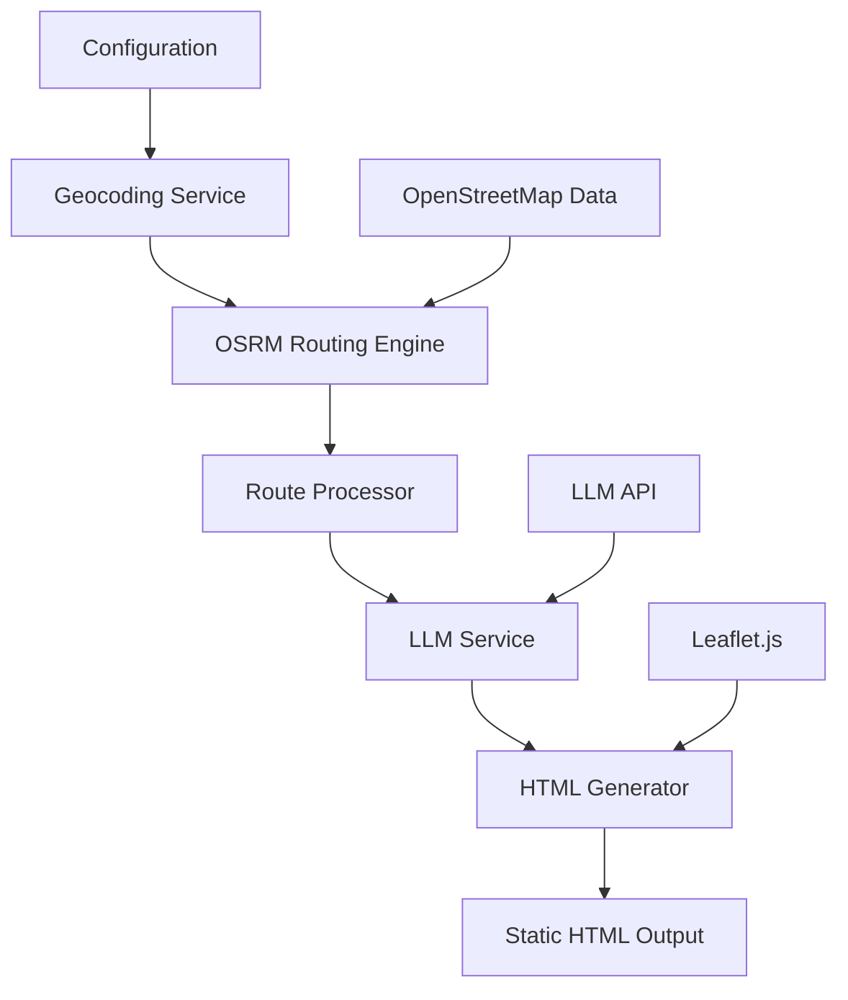

# Technical Architecture

Comprehensive system design for the LLM-Powered Route Planner MVP.

## 🏗️ System Overview

The Pathypotomus architecture follows a pipeline pattern with three main processing stages:

```
Input (Config) → Routing Engine → LLM Service → HTML Generator → Output (Static HTML)
```

### High-Level Architecture



## 🔧 Core Components

### 1. Configuration Manager

**Purpose**: Centralized configuration handling and validation.

**Responsibilities**:
- Load environment variables and config files
- Validate required parameters (origin, destination)
- Provide default values for optional settings
- Handle different address formats (coordinates vs. addresses)

**Key Classes**:
```python
class Config:
    origin_addr: str
    dest_addr: str
    osrm_url: str = "https://router.project-osrm.org"
    llm_api_key: Optional[str]
    llm_model: str = "gpt-3.5-turbo"
    output_path: str = "output.html"
```

**Configuration Sources** (in priority order):
1. Environment variables
2. `.env` file
3. Command-line arguments
4. Default values

### 2. Geocoding Service

**Purpose**: Convert addresses to coordinates for OSRM routing.

**Responsibilities**:
- Handle both address strings and coordinate pairs
- Cache geocoding results to avoid redundant API calls
- Provide fallback geocoding providers
- Validate coordinate formats and ranges

**Implementation Options**:
- **Primary**: Nominatim (OpenStreetMap geocoding)
- **Fallback**: Manual coordinate input
- **Future**: Google Geocoding API, MapBox Geocoding

**Key Methods**:
```python
class GeocodingService:
    def geocode(self, address: str) -> Coordinates
    def reverse_geocode(self, lat: float, lon: float) -> str
    def validate_coordinates(self, coords: Coordinates) -> bool
```

### 3. OSRM Routing Engine

**Purpose**: Generate multiple route alternatives using OpenStreetMap data.

**Responsibilities**:
- Query OSRM API for route alternatives
- Parse and validate OSRM responses
- Extract route geometry, distance, and duration
- Handle OSRM service failures gracefully

**OSRM Integration**:
```python
# Example OSRM API call
GET /route/v1/driving/{lon1},{lat1};{lon2},{lat2}
?alternatives=true
&overview=simplified
&steps=true
&geometries=polyline
```

**Route Processing**:
- Decode polyline geometry to coordinate arrays
- Extract major road names from step summaries
- Calculate human-readable distance/time formats
- Validate route quality (reasonable alternatives)

**Key Classes**:
```python
class OSRMClient:
    def get_routes(self, origin: Coordinates, dest: Coordinates) -> List[Route]
    def decode_polyline(self, encoded: str) -> List[Coordinates]
    def extract_road_names(self, steps: List[Step]) -> List[str]

class Route:
    geometry: List[Coordinates]
    distance: float  # meters
    duration: float  # seconds
    summary: str
    major_roads: List[str]
```

### 4. LLM Service

**Purpose**: Generate human-friendly route names and descriptions.

**Responsibilities**:
- Craft effective prompts for route description
- Call LLM APIs with proper error handling
- Validate and sanitize LLM output
- Implement fallback descriptions for API failures

**Prompt Engineering**:
```python
ROUTE_NAMING_PROMPT = """
Generate a catchy, descriptive name for this driving route:
- Distance: {distance}
- Duration: {duration}
- Major roads: {roads}
- Route type: {route_type}

The name should be under 50 characters and capture the route's character.
Examples: "Coastal Highway Dash", "Downtown Express", "Scenic Valley Drive"
"""

ROUTE_DESCRIPTION_PROMPT = """
Write a 1-2 sentence description for this route:
- Name: {name}
- Distance: {distance}
- Duration: {duration}
- Major roads: {roads}

Focus on what makes this route unique (scenery, speed, roads used).
Keep it under 150 characters and engaging.
"""
```

**LLM Integration**:
```python
class LLMService:
    def generate_route_name(self, route: Route) -> str
    def generate_route_description(self, route: Route, name: str) -> str
    def validate_output(self, text: str) -> bool
    def get_fallback_description(self, route: Route) -> str
```

**Supported LLM Providers**:
- OpenAI GPT (3.5-turbo, 4)
- Anthropic Claude (future)
- Local models via Ollama (future)

### 5. HTML Generator

**Purpose**: Create static, embeddable HTML output with map visualization.

**Responsibilities**:
- Generate self-contained HTML with inline CSS/JS
- Render interactive map using Leaflet.js
- Display route information in clean layout
- Ensure cross-browser compatibility

**Map Rendering**:
- **Base Layer**: OpenStreetMap tiles
- **Route Visualization**: Colored polylines (red, blue, green)
- **Markers**: Start/end points with labels
- **Legend**: Route identification and colors

**HTML Structure**:
```html
<!DOCTYPE html>
<html>
<head>
    <title>Route Options: {origin} to {destination}</title>
    <!-- Inline CSS and Leaflet.js -->
</head>
<body>
    <div id="map"></div>
    <div id="routes">
        <!-- Route cards with names, descriptions, stats -->
    </div>
    <script>
        // Inline JavaScript for map initialization
    </script>
</body>
</html>
```

**Key Classes**:
```python
class HTMLGenerator:
    def generate_html(self, routes: List[EnrichedRoute]) -> str
    def create_map_config(self, routes: List[Route]) -> dict
    def render_route_cards(self, routes: List[EnrichedRoute]) -> str
    def inline_assets(self, html: str) -> str
```

## 📊 Data Models

### Core Data Structures

```python
@dataclass
class Coordinates:
    lat: float
    lon: float
    
    def validate(self) -> bool:
        return -90 <= self.lat <= 90 and -180 <= self.lon <= 180

@dataclass
class Route:
    geometry: List[Coordinates]
    distance: float  # meters
    duration: float  # seconds
    summary: str
    major_roads: List[str]
    
    @property
    def distance_km(self) -> float:
        return self.distance / 1000
    
    @property
    def duration_minutes(self) -> int:
        return int(self.duration / 60)

@dataclass
class EnrichedRoute(Route):
    name: str
    description: str
    color: str
    
    @classmethod
    def from_route(cls, route: Route, name: str, description: str, color: str):
        return cls(**asdict(route), name=name, description=description, color=color)

@dataclass
class RouteRequest:
    origin: Coordinates
    destination: Coordinates
    alternatives: bool = True
    profile: str = "driving"
```

### Configuration Schema

```python
@dataclass
class AppConfig:
    # Required
    origin_addr: str
    dest_addr: str
    
    # Optional with defaults
    osrm_url: str = "https://router.project-osrm.org"
    llm_api_key: Optional[str] = None
    llm_model: str = "gpt-3.5-turbo"
    output_path: str = "routes.html"
    max_routes: int = 3
    
    # Advanced options
    geocoding_provider: str = "nominatim"
    map_zoom: int = 12
    route_colors: List[str] = field(default_factory=lambda: ["#e74c3c", "#3498db", "#2ecc71"])
    
    def validate(self) -> List[str]:
        """Return list of validation errors"""
        errors = []
        if not self.origin_addr:
            errors.append("origin_addr is required")
        if not self.dest_addr:
            errors.append("dest_addr is required")
        return errors
```

## 🔄 Data Flow

### 1. Initialization Phase
```
Config Loading → Validation → Service Initialization
```

1. **Configuration**: Load from environment/files
2. **Validation**: Check required parameters
3. **Service Setup**: Initialize OSRM client, LLM service, etc.

### 2. Route Generation Phase
```
Geocoding → OSRM Query → Route Processing → LLM Enhancement
```

1. **Geocoding**: Convert addresses to coordinates
2. **OSRM Request**: Get route alternatives with geometry
3. **Route Processing**: Decode polylines, extract metadata
4. **LLM Enhancement**: Generate names and descriptions

### 3. Output Generation Phase
```
HTML Template → Map Configuration → Asset Inlining → File Output
```

1. **Template Rendering**: Populate HTML template with route data
2. **Map Setup**: Configure Leaflet.js with route polylines
3. **Asset Bundling**: Inline CSS/JS for portability
4. **File Generation**: Write self-contained HTML file

## 🚀 Deployment Architecture

### Local Development
```
Developer Machine
├── Python Application
├── Local OSRM (Docker)
├── LLM API (External)
└── Static HTML Output
```

### Self-Hosted Production
```
Server/VPS
├── Docker Compose
│   ├── Application Container
│   ├── OSRM Container
│   └── Nginx (optional)
├── OSM Data Volume
└── Configuration Files
```

### Docker Compose Structure
```yaml
version: '3.8'
services:
  osrm:
    image: osrm/osrm-backend
    volumes:
      - ./data:/data
    ports:
      - "5000:5000"
  
  pathypotomus:
    build: .
    environment:
      - OSRM_URL=http://osrm:5000
      - ORIGIN_ADDR=${ORIGIN_ADDR}
      - DEST_ADDR=${DEST_ADDR}
    volumes:
      - ./output:/app/output
    depends_on:
      - osrm
```

## 🔧 Configuration Management

### Environment Variables
```bash
# Required
ORIGIN_ADDR="123 Main St, Springfield, IL"
DEST_ADDR="456 Oak Ave, Shelbyville, IL"

# Optional
OSRM_URL="http://localhost:5000"
LLM_API_KEY="sk-..."
LLM_MODEL="gpt-3.5-turbo"
OUTPUT_PATH="./output/routes.html"

# Advanced
GEOCODING_PROVIDER="nominatim"
MAX_ROUTES=3
MAP_ZOOM=12
```

### Configuration File (.env)
```ini
# Pathypotomus Configuration
ORIGIN_ADDR=123 Main St, Springfield, IL
DEST_ADDR=456 Oak Ave, Shelbyville, IL

# Services
OSRM_URL=https://router.project-osrm.org
LLM_API_KEY=your-api-key-here
LLM_MODEL=gpt-3.5-turbo

# Output
OUTPUT_PATH=./routes.html
```

## 📈 Performance Considerations

### Response Time Targets
- **OSRM Query**: < 1 second
- **LLM Generation**: < 3 seconds (parallel processing)
- **HTML Generation**: < 1 second
- **Total Pipeline**: < 5 seconds

### Optimization Strategies
1. **Parallel Processing**: Generate all route descriptions simultaneously
2. **Caching**: Cache geocoding results and route calculations
3. **Connection Pooling**: Reuse HTTP connections for API calls
4. **Simplified Geometry**: Use OSRM's simplified polylines
5. **Asset Optimization**: Minimize inline CSS/JS

### Scalability Considerations
- **OSRM**: Can handle ~100 requests/second on modest hardware
- **LLM APIs**: Rate limited by provider (OpenAI: 60 RPM for free tier)
- **Memory Usage**: Minimal (< 100MB for route processing)
- **Storage**: Negligible (routes are generated on-demand)

## 🔒 Security & Privacy

### Data Handling
- **No Persistent Storage**: Routes generated on-demand
- **API Key Security**: Environment variables only
- **Input Validation**: Sanitize all user inputs
- **Output Sanitization**: Escape HTML content from LLM

### Self-Hosting Benefits
- **Data Privacy**: No external route data sharing
- **API Control**: Own OSRM instance, choose LLM provider
- **Customization**: Full control over processing pipeline
- **Cost Management**: Predictable infrastructure costs

## 🧪 Testing Strategy

### Unit Testing
- **Configuration**: Validation and loading
- **Geocoding**: Address parsing and coordinate validation
- **OSRM Integration**: API response parsing
- **LLM Service**: Prompt generation and output validation
- **HTML Generation**: Template rendering and asset inlining

### Integration Testing
- **End-to-End**: Full pipeline with real addresses
- **Error Scenarios**: API failures, invalid inputs
- **Performance**: Response time validation
- **Output Quality**: HTML validation and browser testing

### Test Data
- **Sample Addresses**: Various formats and locations
- **Mock Responses**: OSRM and LLM API responses
- **Edge Cases**: Invalid coordinates, API errors
- **Performance Tests**: Large route geometries, multiple requests